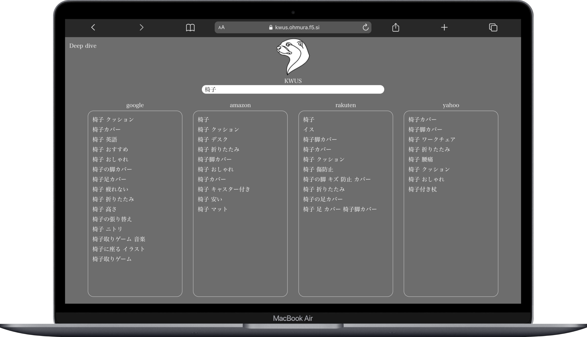
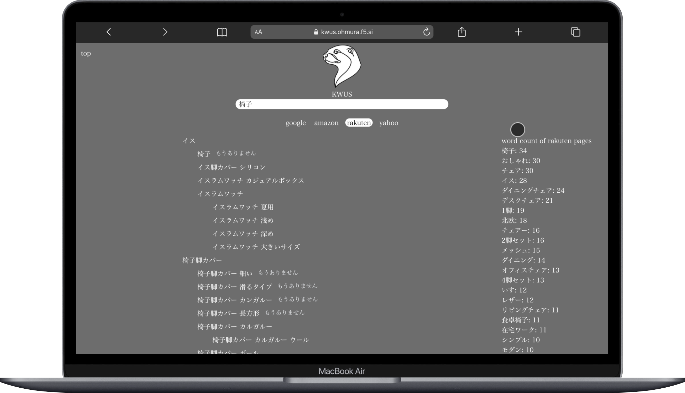

# KWUS --Key Word for Upgrading your SEO--

読み方は"カワウソ"で大袈裟な名前をつけていますが、ラッコキーワードにインスパイアされているだけです 
バイト先の家具屋はECサイトにも出店してるので、そこでの使用を想定してgoogle, amazon, rakuten, yahooに対応しています 
[https://kwus.ohmura.f5.si/](https://kwus.ohmura.f5.si/)

## 使用スタック

## 工夫したところ

Deep diveページではrakutenとyahooで、apiを使いキーワードで検索されるページの説明文等を取得し、キーワードを集計する機能を画面右側に設置した

## 課題

デザインの勉強をしていないのでUIの見栄えが悪い
